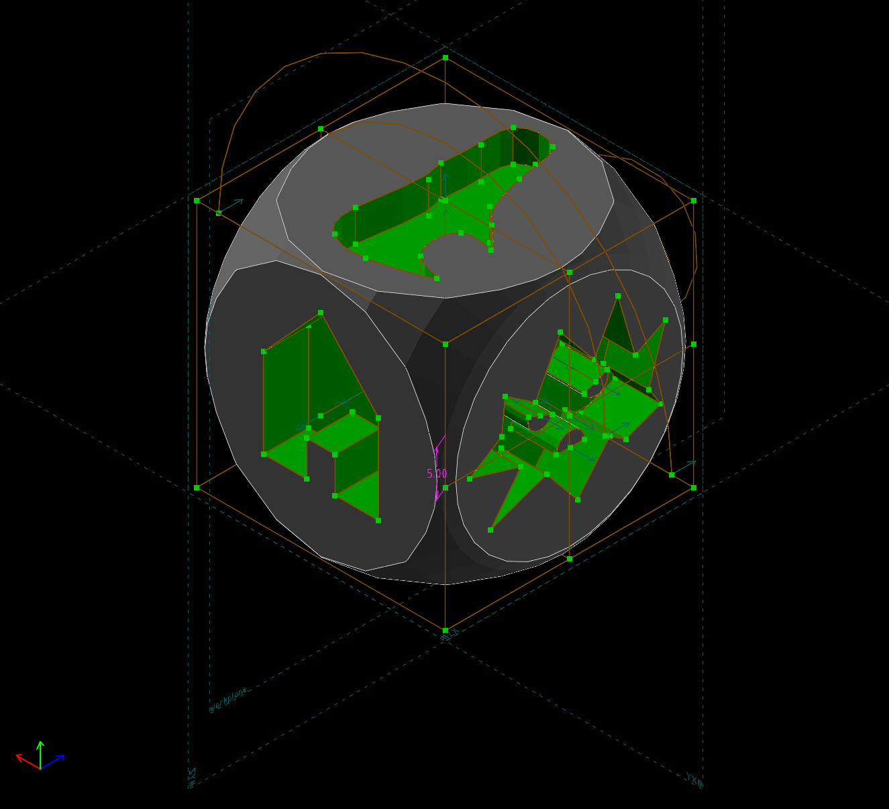
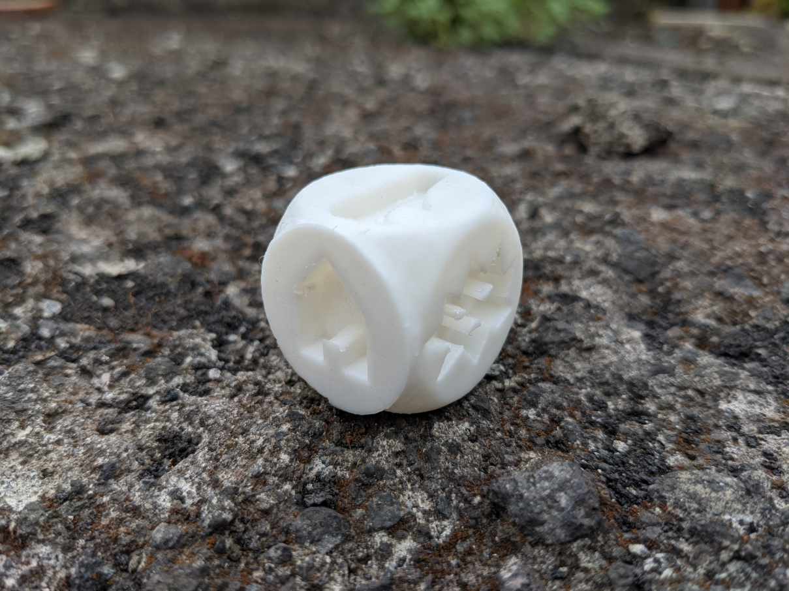

# Story telling dice

This is a story telling dice made using [solvespace](https://solvespace.com/index.pl)
released under CC BY-NC-SA 4.0 with the following faces:

- house
- pacifier
- monster
- shoe
- pinwheel
- egg

## 3D printed

Here some photos of the first revision of the project:

Unfortunately my printer made the house face (the one laid on the printer bed)
a bit more stiking out, I will try to print using supports next time.

You can use the [STL](dice.stl) file I used to print it but keep in mind the
problem I had with the face laying down.
